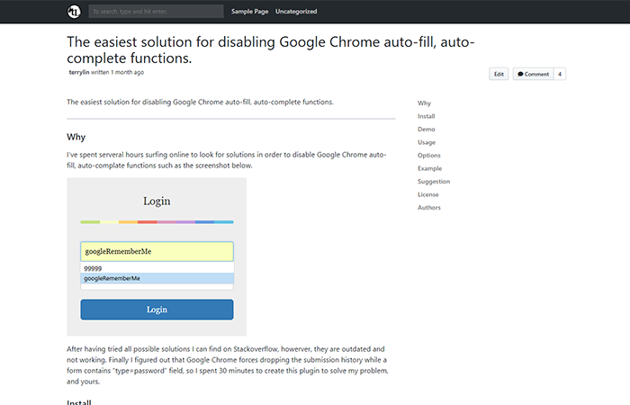

# Githuber

Githuber is a github-style WordPress theme with preferred features for developers.

## Features

- Markdown friendly. The first version you can choose GitHub style or my Githuber style.
- Built-in TOC. Sticky TOC in sidebar.
- Bootstrap 4 nav menu
- New post type - Repository.
- Page reading progress bar.
- Reponsive.
- WordPress Coding Standards - 99.9% passed by PHP_CodeSniffer ([WDCS](https://github.com/WordPress-Coding-Standards/WordPress-Coding-Standards))

#### Preview:

*Page reading progress bar + Sticky TOC*

*GitHub Repository Post*

## Notice

This project is currently under development, please do not use it before releasing the first release version.

Please watch to get the latest updates.

